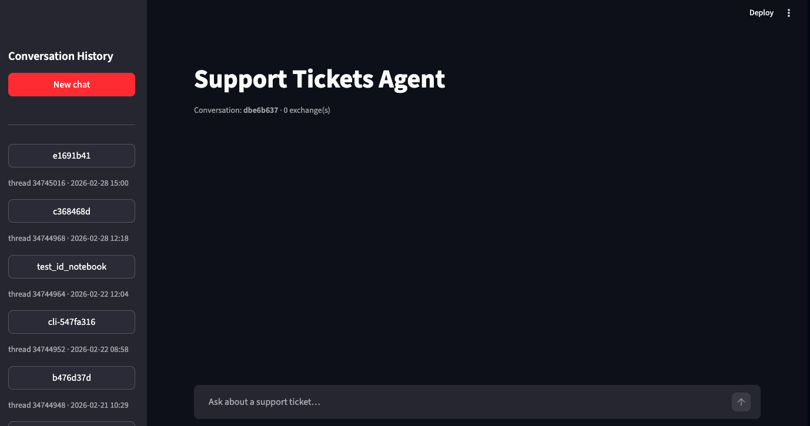
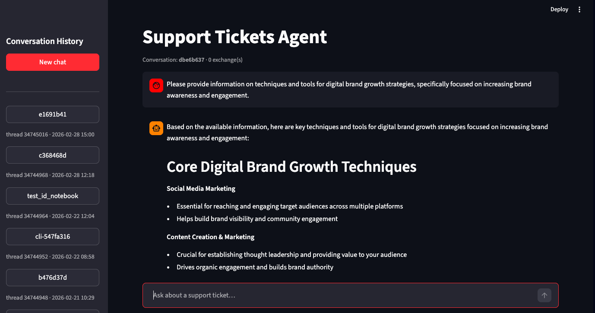
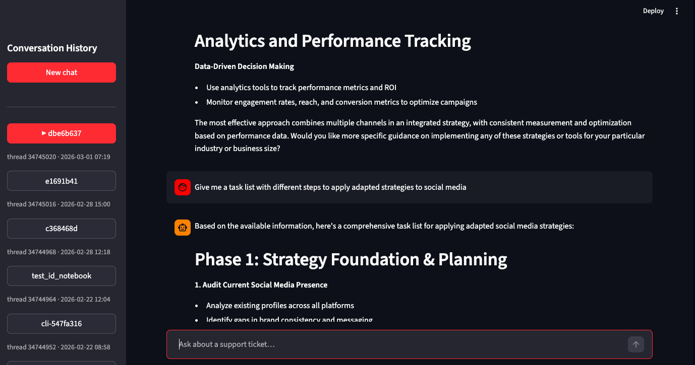
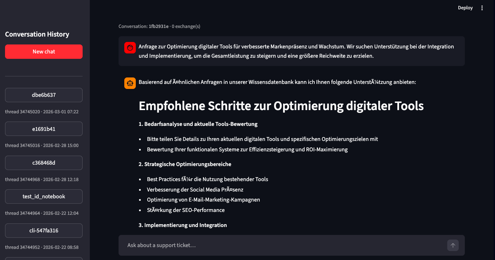
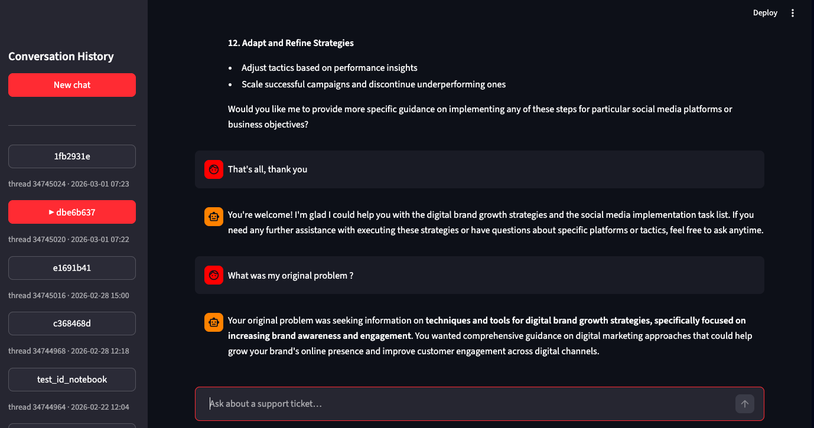

# Support Tickets Agent

A multilingual support ticket processing agent using Snowflake Cortex and LangGraph.

## Overview

This project implements an intelligent agent that:
- Classifies support tickets by topic and intent
- Assigns priority levels (URGENT/HIGH/MEDIUM/LOW)
- Retrieves relevant knowledge base articles using semantic search
- Generates contextual responses
- Applies policy guardrails

## Project Structure

See [docs/Architecture.md](docs/Architecture.md) for detailed architecture and workflow.

```
├── sql/              # Snowflake DDL and setup scripts
├── src/              # Agent library (graph, retrieval, prompts, eval)
├── app/              # Streamlit demo UI
├── scripts/          # CLI entry points
├── notebooks/        # Exploration notebooks
└── tests/            # Unit tests
```

## Setup

1. Copy `.env.example` to `.env` and fill in your Snowflake credentials:
   ```bash
   cp .env.example .env
   ```

2. Set environment and install dependencies:
   ```bash
   py -3.11 -m venv .venv
   source .venv/bin/activate   # Windows: .venv\Scripts\activate
   pip install -r requirements.txt
   ```

3. Set up Snowflake objects:
   ```bash
   # Run SQL scripts in order
   snowsql -f sql/00_setup.sql
   snowsql -f sql/10_ingest.sql
   snowsql -f sql/20_curate.sql
   snowsql -f sql/30_search_service.sql
   snowsql -f sql/35_create_agent.sql
   snowsql -f sql/40_eval_tables.sql
   snowsql -f sql/45_cortex_threads_history.sql
   ```

4. Load data:
   ```bash
   python scripts/load_data.py
   ```

## Development

Install dev dependencies:
```bash
pip install -r requirements-dev.txt
```

Run tests:
```bash
pytest tests/
```

## Usage

Run agent on a single ticket:
```bash
python scripts/run_agent.py --ticket-id 12345
```

Run batch processing:
```bash
python scripts/run_batch.py --input tickets.csv
```

Launch demo app:
```bash
streamlit run app/streamlit_app.py
```

## Git Workflow

- `main`: stable, demo-ready
- `dev`: integration branch
- Feature branches: `feat/ingest`, `feat/search`, `feat/langgraph`, etc.

**Important:** Never commit `.env` or credentials!

## Evaluation

Run evaluation:
```bash
python src/support_agent/eval/run_eval.py
```

View results in `notebooks/03_eval_report.ipynb`


# Démo : 


# Demo

We will demonstrate here with screenshots the different features of the service used by the client.
We will follow this scenario:
- Interface at opening
- 2-3 question conversation
- New conversation
- Switching/Resuming conversation

When opening the application, the client finds a chat system with the ability to converse with the RAG but also to find their other conversations.



We can see that the agent leverages the search service with the knowledge base to best answer the user's question.



We can also continue the conversation with other questions or requests.



We can also converse in another chat in German, for example.



The client can retrieve their old conversations; here we see the first conversation. The context is also preserved and reused by the agent throughout a conversation.

